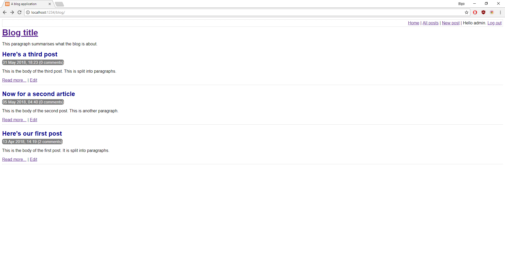
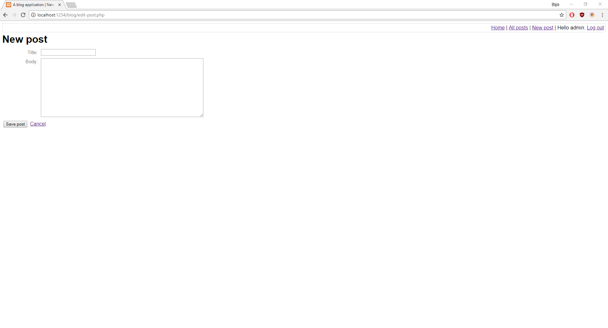
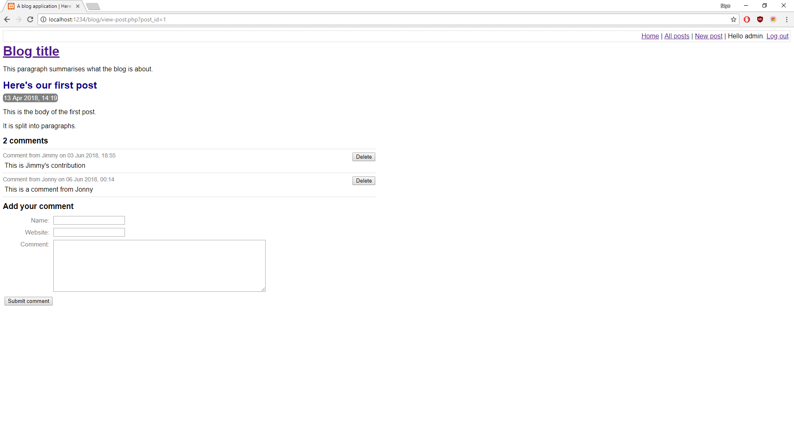
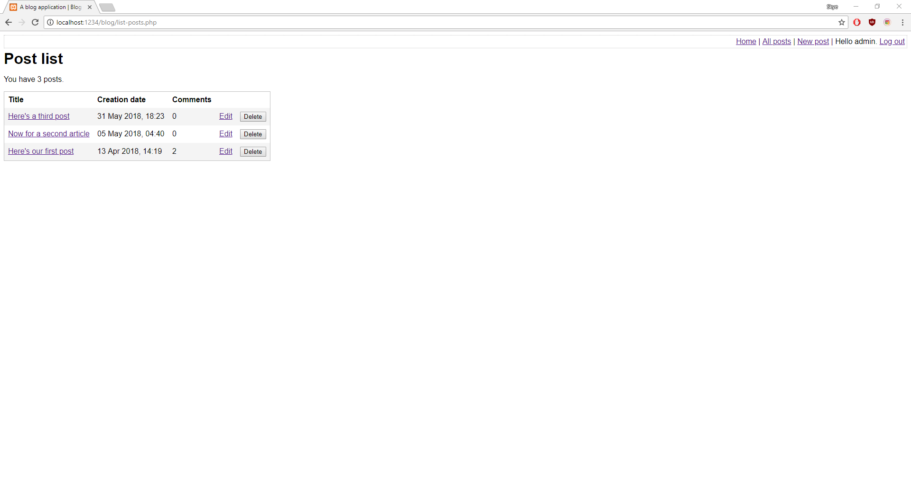

# Blog

I spent a lot of time prior to this project going from front-end to back-end developing trying to decide where my skill set and interests lie.
I've reached the conclusion that PHP & back-end development are what I'd like to take further. This is my first PHP heavy project.
I am focusing entirely on the functionality of the website which leaves the presentation bare bones at this stage.

---

---

---

---

---

## Getting Started

I use the [XAMPP](https://www.apachefriends.org/index.html) stack to develop & test this project locally.

---

## Built With

PHP & HTML.

---

## Author

**Skye Gill** - [Skyerus](https://github.com/Skyerus)
